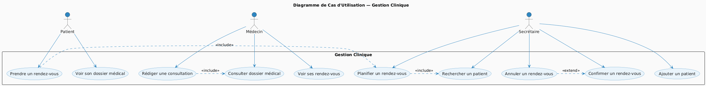
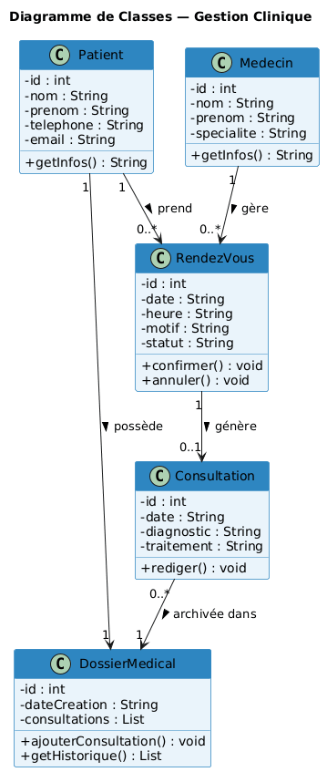

# Clinique-Manager

## Application pour gérer un cabinet médical : patients, médecins et rendez-vous. Permet d’ajouter et suivre les patients, gérer les médecins et planifier les consultations pour un suivi organisé et efficace.

Gestion Clinique est une application orientée objet (POO) avec modélisation UML, conçue pour faciliter la gestion d’un cabinet médical.
Elle permet de gérer les patients, les médecins et les rendez-vous, tout en assurant un suivi clair et organisé des consultations

Fonctionnalités:

* Ajouter et gérer des patients
* Gérer les médecins
* Planifier et suivre les rendez-vous

Technologies utilisées:

* Programmation orientée objet (POO)
* Diagrammes UML (cas d’utilisation, classes, séquence)
* Langage : Python / Java

## Diagramme de Cas d'Utilisation

## Diagramme de Classes

## Auteurs
Projet réalisé par : KHNIBILA Salek & ESSALEHY Abderrahman
